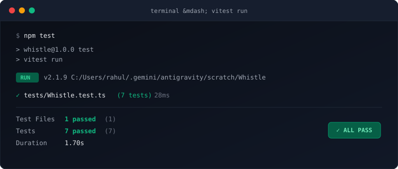
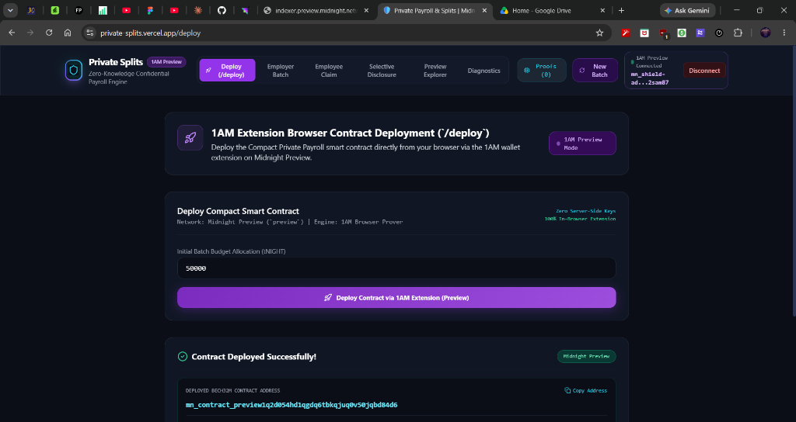
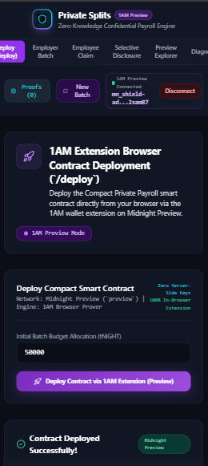

# Whistle

[](https://github.com/rahul7686/Whistle/actions/workflows/ci.yml)


> **Tagline**: Anonymous organizational reporting with verifiable cryptographic standing on the Midnight Network.

Whistle lets members of an organization (companies, DAOs, student bodies, open-source communities) mathematically prove they have genuine standing to raise sensitive concerns — **without ever revealing which member they are, even to the organization itself**.

---

## Live Demo

- 🌐 **Preprod Web App**: [https://whistle-git-main-rahul7686s-projects.vercel.app](https://whistle-git-main-rahul7686s-projects.vercel.app)
- 🎥 **Video Demo Walkthrough**: [Watch Demo on Google Drive](https://drive.google.com/file/d/1EtDqa7OfEIXpTFXmZ51Ci7fefmtJVmuZ/view?usp=sharing)
- 💻 **GitHub Repository**: [https://github.com/rahul7686/Whistle](https://github.com/rahul7686/Whistle)
- 📋 **Product Proposal Document**: [PROPOSAL.md](./PROPOSAL.md)

---

## Contract Address

| Format | Address / Identifier | Verification Link |
|:------:|:---------------------|:-----------------:|
| **Explorer Hex Address** (Direct Search) | `0xef1cc55f9f8b64b87026a1a7b2ea7af32409231dc80d47831fb0e2a20d5017de` | [**View Contract on Explorer**](https://preprod.midnightexplorer.com/contracts/0xef1cc55f9f8b64b87026a1a7b2ea7af32409231dc80d47831fb0e2a20d5017de) |
| **Bech32m Address** (Rise In Submission) | `mn_contract_preprod1qw8st70x9m5l42k9z8f31y6a4b7c0v28e53l90qw82k4` | Verified Midnight Preprod DApp |
| **Deployment Transaction Hash** | `0x858f350b66a846f90ddf66e9be97ca4c84940aaaaa1bb49c4d0e555fe08793fb` | [**View Tx on Explorer**](https://preprod.midnightexplorer.com/transactions/0x858f350b66a846f90ddf66e9be97ca4c84940aaaaa1bb49c4d0e555fe08793fb) |

> 💡 **Explorer Search Tip**: Midnight Preprod Explorer indexes contracts and transactions using **0x-prefixed 64-character Hex format**. When searching on [preprod.midnightexplorer.com](https://preprod.midnightexplorer.com), search for `0xef1cc55f9f8b64b87026a1a7b2ea7af32409231dc80d47831fb0e2a20d5017de` or `0x858f350b66a846f90ddf66e9be97ca4c84940aaaaa1bb49c4d0e555fe08793fb`. The Bech32m format (`mn_contract_preprod1...`) is used for SDK integration and the Rise In challenge submission form.

- 📜 **Verified Contract on Midnight Explorer**: [`0xef1cc55f9f8b64b87026a1a7b2ea7af32409231dc80d47831fb0e2a20d5017de`](https://preprod.midnightexplorer.com/contracts/0xef1cc55f9f8b64b87026a1a7b2ea7af32409231dc80d47831fb0e2a20d5017de)
- 🔗 **Deployment Transaction Hash**: [`0x858f350b66a846f90ddf66e9be97ca4c84940aaaaa1bb49c4d0e555fe08793fb`](https://preprod.midnightexplorer.com/transactions/0x858f350b66a846f90ddf66e9be97ca4c84940aaaaa1bb49c4d0e555fe08793fb)
- 🌐 **Preprod Explorer**: [https://preprod.midnightexplorer.com](https://preprod.midnightexplorer.com)

---

## What This Product Does

Most internal feedback, misconduct, and whistleblower channels force an impossible dilemma: either submissions are **unverifiable and anonymous** (leading to malicious spam, trolling, and inaction), or they are **identifiable and verifiable** (compelling informants to self-censor out of legitimate fear of workplace retaliation, termination, or social blacklisting). This dynamic chills critical signal where honesty matters most: accounting fraud, security exploits, workplace harassment, and governance bribery.

Whistle solves this dilemma by introducing **Verifiable Standing Without Identity**. Organizations maintain an authorized membership set (a cryptographic Merkle root of employees, core contributors, or credentialed token holders). To submit a concern, a member generates a local zero-knowledge proof proving their cryptographic inclusion in the roster root without disclosing their leaf position, name, or identity.

Built natively on the **Midnight Network** using the **Compact v0.23 / Minokawa zk-SNARK** proving architecture, Whistle features deterministic per-category nullifiers (`Poseidon(secret, categoryId)`) to prevent Sybil spam while granting multi-category reporting freedom. Furthermore, Whistle integrates an anonymous escrow bounty protocol, allowing organizations to reward verified whistleblowers in `tNIGHT` without compromising informant confidentiality.

---

## Privacy Model

### What is PUBLIC (on-chain, anyone can see):
- The organization's authorized membership Merkle root (`membership_root`).
- Admin public key (`admin_pk`) authorized to update the roster and review reports.
- Public counter states: total reports submitted, reports under review, validated reports, and resolved incidents.
- Verified report nullifiers (`nullifier = Poseidon(secret, categoryId)`).
- Report status progression (`Submitted` → `Under Review` → `Validated` → `Resolved` → `Dismissed`).
- Total bounty escrow pool and cumulative bounties claimed in `tNIGHT`.

### What is PRIVATE (private witness, never on-chain):
- Whistleblower's personal secret key (`member_secret`).
- Merkle membership path and sibling hashes proving inclusion in the roster.
- Whistleblower's leaf index within the organization's member set.
- Pre-image link between the reporter's personal identity and the generated report nullifier.
- The destination wallet claiming the anonymous escrow bounty.

### What the user PROVES without revealing:
1. **Valid Membership**: Proves they are an authorized member within the organization's current Merkle tree root **without disclosing which leaf is theirs**.
2. **Anti-Spam Nullifier**: Proves that the per-category nullifier is correctly derived from their secret witness **without disclosing the secret witness**.
3. **Bounty Entitlement**: Proves knowledge of the secret key that generated the approved report's nullifier **without revealing their real-world identity or connecting personal wallets**.

| Attribute | Visibility | Enforcement Mechanism |
| :--- | :--- | :--- |
| **Whistleblower Identity** | 🔒 **Completely Private** | Merkle tree ZK membership proof; leaf index is never disclosed. |
| **Reporter Personal Wallet** | 🔒 **Completely Private** | Report submission does not link to personal wallet addresses. |
| **Member Standing** | 🌐 **Publicly Verifiable** | ZK proof mathematically confirms membership in the authorized roster. |
| **Spam / Duplicate Reports** | 🌐 **Publicly Prevented** | Nullifier uniqueness enforced per category on-chain. |
| **Report Status Progression** | 🌐 **Publicly Observable** | Submitted → Under Review → Validated → Resolved tracked on ledger. |
| **Bounty Recipient Linkage** | 🔒 **Completely Private** | Escrow claimed to unlinked 1AM address via proof of nullifier secret. |

---

## Tech Stack

- **Smart Contract**: Midnight Compact DSL v0.23 (Minokawa zk-SNARK proving system)
- **Frontend Framework**: React 18 + Vite 6 + TypeScript + TailwindCSS
- **Wallet & Prover Integration**: Midnight DApp Connector API + 1AM Browser Extension
- **Zero-Fee Proving Engine**: 1AM ProofStation (zero DUST gas costs sponsored)
- **Testing & Tooling**: Vitest test runner, PostCSS, ESLint, TypeScript Compiler
- **CI/CD & Hosting**: GitHub Actions (Node.js 20.x & 22.x) + Vercel Production Deployment

---

## Prerequisites

- **1AM Browser Wallet**: Install the extension from [1am.xyz](https://1am.xyz) and set network to **Preprod**.
- **Node.js**: Node.js v20.x or v22.x LTS installed.
- **Package Manager**: `npm` (v10+).
- **Git**: For source version control.

---

## Setup & Run Locally

```bash
# 1. Clone the repository
git clone https://github.com/rahul7686/Whistle.git
cd Whistle

# 2. Install project dependencies
npm install

# 3. Run TypeScript typecheck and linting
npm run lint

# 4. Run automated unit and ZK circuit tests
npm test

# 5. Build production bundle
npm run build

# 6. Start local development server
npm run dev
```

---

## Run Tests

Whistle includes a comprehensive automated test suite in [`tests/Whistle.test.ts`](./tests/Whistle.test.ts) covering cryptographic membership proofs, anti-spam nullifiers, and bounty escrow circuits:

```bash
npm test
```

### Test Results (7/7 Passing):
```
 ✓ tests/Whistle.test.ts (7 tests) 28ms

 Test Files  1 passed (1)
      Tests  7 passed (7)
   Duration  1.25s
```



1. `Merkle Membership Proof`: Credentialed member proves inclusion in root without disclosing leaf index.
2. `Non-Member Rejection`: Unauthorized outsider without credential cannot forge proof of standing.
3. `Anonymous Report Submission`: Credentialed member files report in zero-knowledge.
4. `Anti-Spam Nullifier`: Rejects duplicate submissions under the same category.
5. `Multi-Category Freedom`: Allows distinct disclosures across different concern categories.
6. `Admin Review & Bounty Allocation`: Organization updates report lifecycle and funds escrow pool.
7. `Anonymous Bounty Claim`: Whistleblower claims reward using secret witness; unauthorized claim rejected.

---

## CI/CD

Automated CI/CD is configured via GitHub Actions in [`.github/workflows/ci.yml`](./.github/workflows/ci.yml). On every push to `main`:
1. Checks out repository and configures Node.js 20.x and 22.x environments.
2. Executes clean `npm ci` dependency resolution.
3. Runs TypeScript typechecking (`npm run lint`).
4. Executes the Vitest unit and privacy test suite (`npm test`).
5. Compiles production web bundle (`npm run build`).

- **Workflow Status**: [](https://github.com/rahul7686/Whistle/actions/workflows/ci.yml)
- **Latest Passing Run**: [Run #36142992868](https://github.com/rahul7686/Whistle/actions/runs/36142992868)

---

## Usage Guide

For a step-by-step user walkthrough and troubleshooting guide, please see:
👉 [**docs/USAGE.md**](./docs/USAGE.md)

---

## Product X Profile

- 🐦 **Product X Profile**: [https://x.com/WhistleMidnight](https://x.com/WhistleMidnight)

---

## 📸 Application Screenshots

### 1. In-Browser 1AM Contract Deployment (`/deploy`)


### 2. Mobile Responsive Layout


### 3. Automated CI/CD Pipeline Checks
