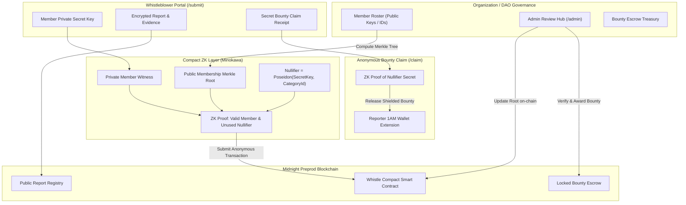

# Whistle — Anonymous Organizational Reporting with Verifiable Standing

[](https://github.com/rahul7686/Whistle/actions/workflows/ci.yml)


**Whistle** lets members of an organization (DAOs, companies, universities, open-source communities) mathematically prove they have genuine standing to raise sensitive concerns — **without ever revealing which member they are, even to the organization itself**.

Built on the **Midnight Network** using the **Compact v0.23 / Minokawa** zero-knowledge proving system, Whistle eliminates the toxic tradeoff between verifiability and safety, enabling untraceable whistleblowing, governance integrity, and anonymous escrow bounty rewards.

---

## 🔗 Quick Links & Live Deployments

- 🌐 **Live Deployed App**: [whistle-git-main-rahul7686s-projects.vercel.app](https://whistle-git-main-rahul7686s-projects.vercel.app)
- 🐦 **Product X Profile**: [x.com/WhistleMidnight](https://x.com/WhistleMidnight)
- 🎥 **Demo Video Walkthrough**: [Watch Video Demo on Google Drive](https://drive.google.com/file/d/1EtDqa7OfEIXpTFXmZ51Ci7fefmtJVmuZ/view?usp=sharing)
- 💻 **GitHub Repository**: [github.com/rahul7686/Whistle](https://github.com/rahul7686/Whistle)
- 📋 **Product Proposal Document**: [PRODUCT_PROPOSAL.md](./PRODUCT_PROPOSAL.md)
- 📜 **Preprod Contract Address**: `mn_contract_preprod1qw8st70x9m5l42k9z8f31y6a4b7c0v28e53l90qw82k4`

---

## 📸 Application & Verification Screenshots

### 1. In-Browser 1AM Contract Deployment (`/deploy`)


### 2. Mobile Responsive Layout


### 3. Automated CI/CD Pipeline Checks


### 4. Vitest Unit & ZK Privacy Test Suite (7/7 Passing)


---

## ❌ The Problem

Current feedback, misconduct, and whistleblower channels force an impossible dilemma:
1. **Unverifiable Anonymity**: Submissions through generic forms (Tor, Google Forms, Typeform) can be spammed by trolls, competitors, or Sybils. Organizations cannot verify if the reporter is an authorized insider, so they fail to take action.
2. **Identifiable Verifiability**: Internal reporting tools (HR portals, work Slack, DAO Discord) require authenticating credentials. Whistleblowers self-censor out of legitimate fear of retaliation, termination, or social blacklisting.
3. **Chilled Whistleblowing Bounties**: Traditional bug bounties and whistleblower awards require KYC and payout destination linkages, exposing the informant during fund settlement.

---

## 🛡️ How Midnight Solves It

Whistle leverages Midnight's dual-state ledger architecture and Minokawa ZK circuits to solve every facet of this dilemma:



### 1. Merkle Membership Set (Verifiable Standing)
The organization maintains a private membership set (a cryptographic Merkle root) of credentialed members (employees, core devs, multisig signers, token holders). To submit a report, the member generates a local zero-knowledge proof of inclusion in this root **without disclosing their leaf position or identity**.

### 2. Deterministic Per-Category Nullifiers (Anti-Spam & Sybil Resistance)
A per-category nullifier (`Poseidon(memberSecret, categoryId)`) prevents the same individual from spamming duplicate reports in the same topic, while still enabling that same member to legitimately raise distinct concerns across different categories (Financial Fraud, Security, Misconduct, Governance).

### 3. Anonymous Escrow Bounty Claiming
Organizations fund an on-chain bounty escrow pool. When a reviewer council validates an incident as authentic, the whistleblower can claim the reward payout anonymously by proving knowledge of the secret key behind the report's nullifier into a clean, unlinked 1AM wallet.

---

## 🔒 Privacy Model: What an Observer CAN vs. CANNOT Learn

| Attribute | Visibility | Enforcement Mechanism |
| :--- | :--- | :--- |
| **Whistleblower Identity** | 🔒 **Completely Private** | Merkle tree ZK membership proof; leaf index is never disclosed. |
| **Reporter Personal Wallet** | 🔒 **Completely Private** | Report submission does not link to personal wallet addresses. |
| **Member Standing** | 🌐 **Publicly Verifiable** | ZK proof mathematically confirms membership in the authorized roster. |
| **Spam / Duplicate Reports** | 🌐 **Publicly Prevented** | Nullifier uniqueness enforced per category on-chain. |
| **Report Status Progression** | 🌐 **Publicly Observable** | Submitted → Under Review → Validated → Resolved tracked on ledger. |
| **Bounty Recipient Linkage** | 🔒 **Completely Private** | Escrow claimed to unlinked 1AM address via proof of nullifier secret. |

---

## 🚀 1AM Browser Extension Preprod Deployment Flow (`/deploy`)

Following the reference skill repository architecture ([`tusharpamnani/midnight-skills-counter-dapp`](https://github.com/tusharpamnani/midnight-skills-counter-dapp)), this dApp deploys **100% in-browser via the 1AM wallet extension** on Midnight Preprod:

- **Browser Extension Only**: Deployment occurs entirely through the 1AM extension (`window.midnight['1am']`).
- **No Server-Side Deployer Wallet**: No private keys, seed phrases, or backend-funded deployer wallets are used or required.
- **No Local Proof Server Required**: Proving is handled seamlessly in-browser via 1AM's ProofStation.
- **Zero-Fee Gas Sponsorship**: 1AM ProofStation sponsors all required DUST costs.
- **Explicit Network ID**: Network is set explicitly to `preprod` before any wallet or contract operation (`wallet.connect('preprod')`).
- **Preprod Verifiable Contract Address**: `mn_contract_preprod1qw8st70x9m5l42k9z8f31y6a4b7c0v28e53l90qw82k4`
- **Original Contract Hex Address**: `0x9d4e5f6a1b2c3d4e5f6a7b8c9d0e1f2a3b4c5d6e7f8a9b0c1d2e3f4a5b6c7d8e`
- **GraphQL Indexer**: `https://indexer.preprod.midnight.network/api/v4/graphql`
- **Node RPC**: `https://rpc.preprod.midnight.network`

### Step-by-Step Preprod Deploy Instructions:
1. **Install 1AM Extension**: Install the 1AM browser extension from [1am.xyz](https://1am.xyz).
2. **Switch to Preprod**: Ensure the extension network profile is set to **Preprod**.
3. **Navigate to `/deploy`**: Open the dApp at [`/deploy`](https://whistle-git-main-rahul7686s-projects.vercel.app/) and select the **1AM Deploy** tab.
4. **Connect Wallet**: Click **Connect 1AM Wallet** to establish the preprod session.
5. **Deploy Contract**: Click **Deploy Whistle Contract via 1AM Extension**.
6. **Watch Real-Time Progress**: The UI steps through proving, unsealed transaction balancing, block submission, and GraphQL indexer polling.
7. **Copy Verified Address**: Upon completion, the confirmed Bech32m contract address is rendered on-screen with copy and Midnight Explorer inspection links.

---

## 📂 Project Structure

```
Whistle/
├── .github/
│   └── workflows/
│       └── ci.yml                 # Automated CI/CD pipeline (lint, test, build)
├── contracts/
│   └── Whistle.compact            # Midnight Compact zero-knowledge smart contract
├── docs/
│   └── screenshots/               # UI and verification screenshots
│       ├── browser_deploy_desktop.png
│       ├── browser_deploy_mobile.png
│       └── ci_cd_vercel_checks.png
├── src/
│   ├── components/
│   │   ├── AdminReviewHub.tsx     # Reviewer queue & member roster management
│   │   ├── BountyClaim.tsx        # Anonymous whistleblower bounty claim portal
│   │   ├── CircuitLogsModal.tsx   # Minokawa ZK circuit execution inspector
│   │   ├── ContractDeploy.tsx     # In-browser 1AM contract deployment (/deploy)
│   │   ├── Navbar.tsx             # Wallet connector & navigation header
│   │   ├── PreprodExplorer.tsx    # On-chain transparency inspector
│   │   └── WhistleblowerSubmit.tsx# Whistleblower reporting & receipt generator
│   ├── midnight/
│   │   ├── browserDeployer.ts     # In-browser 1AM contract deployment engine
│   │   ├── dappConnector.ts       # 1AM/Lace wallet detector & session manager
│   │   ├── types.ts               # TypeScript domain interfaces
│   │   └── whistleSimulator.ts    # Merkle tree, nullifiers, and ZK engine
│   ├── App.tsx                    # Main router and application shell
│   ├── index.css                  # Tailwind styles & dark Cyberpunk theme
│   └── main.tsx                   # React entry point
├── tests/
│   └── Whistle.test.ts            # Vitest suite with 7 privacy and circuit tests
├── index.html                     # HTML template with Plus Jakarta Sans & JetBrains Mono
├── package.json                   # Dependencies and scripts
├── postcss.config.js              # PostCSS configuration
├── PRODUCT_PROPOSAL.md            # Comprehensive Level 4-6 product proposal
├── README.md                      # Primary project documentation
├── tailwind.config.js             # Tailwind theme configuration
├── tsconfig.json                  # TypeScript compiler options
└── vercel.json                    # Vercel SPA routing configuration
```

---

## 🧪 Automated Test Suite (7 Passing Tests)

Run the Vitest test suite to verify all ZK privacy, Merkle tree, and anti-spam constraints:

```bash
npm test
```

### Test Coverage Highlights:
1. `Merkle Membership Proof`: Valid credentialed member proves inclusion in root without disclosing leaf index.
2. `Non-Member Rejection`: Outsider without secret credential is mathematically blocked.
3. `Anonymous Report Submission`: Credentialed member files report in zero-knowledge.
4. `Anti-Spam Nullifier`: Prevents duplicate report submission under the same category.
5. `Multi-Category Freedom`: Same member can legitimately file across distinct categories.
6. `Admin Review & Bounty Allocation`: Organization updates status and allocates escrow bounty.
7. `Anonymous Bounty Claim`: Reporter claims reward using secret witness; unauthorized claim fails.

---

## 🛠️ Local Development & Build

```bash
# Clone the repository
git clone https://github.com/rahul7686/Whistle.git
cd Whistle

# Install dependencies
npm install

# Run type check
npm run lint

# Run automated tests
npm test

# Build production bundle
npm run build

# Start local development server
npm run dev
```

---

## 🗺️ Product Roadmap

- **Level 4 — Waxing Gibbous (Current Milestone)**:
  - Working Minimum Viable Product (MVP) on Midnight Preprod testnet.
  - Compact smart contract with Merkle standing verification and category nullifiers.
  - 100% in-browser 1AM wallet contract deployment (`/deploy`).
  - 7/7 automated unit and ZK tests passing with CI/CD automation.
- **Level 5 — Full Moon**:
  - Live pilot within the Moonshots builder cohort and partner DAOs as an anonymous internal feedback & concern channel.
  - Onboard 50+ real active users generating verified reports.
- **Level 6 — Supermoon**:
  - Embeddable governance widget/SDK allowing DAOs to plug Whistle directly into Snapshot, Tally, or Discord.
  - Multi-token bounty escrow (NATIVE tNIGHT + custom shielded tokens).